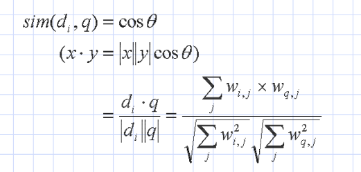

## Boolean model

## The vector space model
* Both documents and queries are vectors
* Similarity is measured to find the cosine of the angle between the query and document vector
* 
* Using this model, the models are ranked by decreasing cosine value
* All terms should not be considered the same, need to introduce term weighing
* A higher weight will have greater impacton the cosine
* An example of how to choose important terms could be to say that keywords in a wuery are important
* to represent the importance of different words we can also use tf-idf weighing
* Term frequency measures how well a term describes a document
* Inverse docuemnt frequenzy says that a terms scarcity should be a measure of its importance
